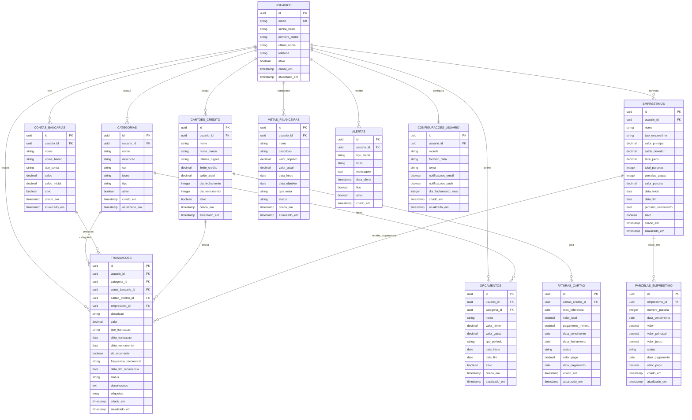

# Banco de dados

# 📋 Documentação das Tabelas do Sistema Financeiro

## 👤 Tabela: usuarios

| Campo | Tipo | Restrições | Descrição |
|-------|------|------------|-----------|
| `id` | UUID | PK, NOT NULL, DEFAULT uuid_generate_v4() | Identificador único do usuário |
| `email` | VARCHAR(255) | UNIQUE, NOT NULL | Email do usuário para login |
| `senha_hash` | VARCHAR(255) | NOT NULL | Senha criptografada com bcrypt |
| `primeiro_nome` | VARCHAR(100) | NOT NULL | Primeiro nome do usuário |
| `ultimo_nome` | VARCHAR(100) | NOT NULL | Sobrenome do usuário |
| `telefone` | VARCHAR(20) | NULL | Número de telefone para contato |
| `ativo` | BOOLEAN | DEFAULT true | Status ativo/inativo do usuário |
| `criado_em` | TIMESTAMP WITH TIME ZONE | DEFAULT CURRENT_TIMESTAMP | Data de criação do registro |
| `atualizado_em` | TIMESTAMP WITH TIME ZONE | DEFAULT CURRENT_TIMESTAMP | Data da última atualização |

**Relacionamentos:**
- Um usuário pode ter muitas categorias, contas, cartões, empréstimos, transações, orçamentos, metas e alertas
- Um usuário tem uma configuração

---

## 🏷️ Tabela: categorias

| Campo | Tipo | Restrições | Descrição |
|-------|------|------------|-----------|
| `id` | UUID | PK, NOT NULL, DEFAULT uuid_generate_v4() | Identificador único da categoria |
| `usuario_id` | UUID | FK → usuarios(id), NOT NULL, ON DELETE CASCADE | Referência ao usuário proprietário |
| `nome` | VARCHAR(100) | NOT NULL | Nome da categoria |
| `descricao` | TEXT | NULL | Descrição detalhada da categoria |
| `cor` | VARCHAR(7) | NULL | Cor em formato hexadecimal (#FFFFFF) |
| `icone` | VARCHAR(50) | NULL | Nome do ícone para interface |
| `tipo` | VARCHAR(20) | CHECK (tipo IN ('receita', 'despesa')), NOT NULL | Tipo da categoria |
| `ativo` | BOOLEAN | DEFAULT true | Status ativo/inativo da categoria |
| `criado_em` | TIMESTAMP WITH TIME ZONE | DEFAULT CURRENT_TIMESTAMP | Data de criação do registro |
| `atualizado_em` | TIMESTAMP WITH TIME ZONE | DEFAULT CURRENT_TIMESTAMP | Data da última atualização |

**Restrições Únicas:**
- `UNIQUE(usuario_id, nome, tipo)` - Evita categorias duplicadas por usuário

**Relacionamentos:**
- Pertence a um usuário
- Pode ser usada em muitas transações e orçamentos

---

## �� Tabela: contas_bancarias

| Campo | Tipo | Restrições | Descrição |
|-------|------|------------|-----------|
| `id` | UUID | PK, NOT NULL, DEFAULT uuid_generate_v4() | Identificador único da conta |
| `usuario_id` | UUID | FK → usuarios(id), NOT NULL, ON DELETE CASCADE | Referência ao usuário proprietário |
| `nome` | VARCHAR(100) | NOT NULL | Nome identificador da conta |
| `nome_banco` | VARCHAR(100) | NULL | Nome da instituição bancária |
| `tipo_conta` | VARCHAR(20) | CHECK (tipo_conta IN ('corrente', 'poupanca', 'investimento', 'dinheiro')), NOT NULL | Tipo da conta bancária |
| `saldo` | DECIMAL(15,2) | DEFAULT 0.00 | Saldo atual da conta |
| `saldo_inicial` | DECIMAL(15,2) | DEFAULT 0.00 | Saldo inicial quando criada |
| `ativo` | BOOLEAN | DEFAULT true | Status ativo/inativo da conta |
| `criado_em` | TIMESTAMP WITH TIME ZONE | DEFAULT CURRENT_TIMESTAMP | Data de criação do registro |
| `atualizado_em` | TIMESTAMP WITH TIME ZONE | DEFAULT CURRENT_TIMESTAMP | Data da última atualização |

**Relacionamentos:**
- Pertence a um usuário
- Pode ser usada em muitas transações

---

## 💳 Tabela: cartoes_credito

| Campo | Tipo | Restrições | Descrição |
|-------|------|------------|-----------|
| `id` | UUID | PK, NOT NULL, DEFAULT uuid_generate_v4() | Identificador único do cartão |
| `usuario_id` | UUID | FK → usuarios(id), NOT NULL, ON DELETE CASCADE | Referência ao usuário proprietário |
| `nome` | VARCHAR(100) | NOT NULL | Nome identificador do cartão |
| `nome_banco` | VARCHAR(100) | NULL | Nome da instituição emissora |
| `ultimos_digitos` | VARCHAR(4) | NULL | Últimos 4 dígitos do cartão |
| `limite_credito` | DECIMAL(15,2) | NOT NULL | Limite total do cartão |
| `saldo_atual` | DECIMAL(15,2) | DEFAULT 0.00 | Saldo devedor atual |
| `dia_fechamento` | INTEGER | CHECK (dia_fechamento BETWEEN 1 AND 31), NOT NULL | Dia do fechamento da fatura |
| `dia_vencimento` | INTEGER | CHECK (dia_vencimento BETWEEN 1 AND 31), NOT NULL | Dia do vencimento da fatura |
| `ativo` | BOOLEAN | DEFAULT true | Status ativo/inativo do cartão |
| `criado_em` | TIMESTAMP WITH TIME ZONE | DEFAULT CURRENT_TIMESTAMP | Data de criação do registro |
| `atualizado_em` | TIMESTAMP WITH TIME ZONE | DEFAULT CURRENT_TIMESTAMP | Data da última atualização |

**Relacionamentos:**
- Pertence a um usuário
- Pode ser usado em muitas transações
- Gera muitas faturas

---

## 🏠 Tabela: emprestimos

| Campo | Tipo | Restrições | Descrição |
|-------|------|------------|-----------|
| `id` | UUID | PK, NOT NULL, DEFAULT uuid_generate_v4() | Identificador único do empréstimo |
| `usuario_id` | UUID | FK → usuarios(id), NOT NULL, ON DELETE CASCADE | Referência ao usuário proprietário |
| `nome` | VARCHAR(100) | NOT NULL | Nome identificador do empréstimo |
| `tipo_emprestimo` | VARCHAR(20) | CHECK (tipo_emprestimo IN ('pessoal', 'habitacional', 'veiculo', 'estudantil', 'empresarial')), NOT NULL | Tipo do empréstimo |
| `valor_principal` | DECIMAL(15,2) | NOT NULL | Valor original emprestado |
| `saldo_devedor` | DECIMAL(15,2) | NOT NULL | Saldo atual a pagar |
| `taxa_juros` | DECIMAL(5,2) | NOT NULL | Taxa de juros anual (%) |
| `total_parcelas` | INTEGER | NOT NULL | Número total de parcelas |
| `parcelas_pagas` | INTEGER | DEFAULT 0 | Número de parcelas já pagas |
| `valor_parcela` | DECIMAL(15,2) | NOT NULL | Valor de cada parcela |
| `data_inicio` | DATE | NOT NULL | Data de início do empréstimo |
| `data_fim` | DATE | NOT NULL | Data prevista para quitação |
| `proximo_vencimento` | DATE | NULL | Data do próximo vencimento |
| `ativo` | BOOLEAN | DEFAULT true | Status ativo/inativo do empréstimo |
| `criado_em` | TIMESTAMP WITH TIME ZONE | DEFAULT CURRENT_TIMESTAMP | Data de criação do registro |
| `atualizado_em` | TIMESTAMP WITH TIME ZONE | DEFAULT CURRENT_TIMESTAMP | Data da última atualização |

**Relacionamentos:**
- Pertence a um usuário
- Pode receber muitos pagamentos (transações)
- Tem muitas parcelas

---

## 💰 Tabela: transacoes

| Campo | Tipo | Restrições | Descrição |
|-------|------|------------|-----------|
| `id` | UUID | PK, NOT NULL, DEFAULT uuid_generate_v4() | Identificador único da transação |
| `usuario_id` | UUID | FK → usuarios(id), NOT NULL, ON DELETE CASCADE | Referência ao usuário proprietário |
| `categoria_id` | UUID | FK → categorias(id), NULL, ON DELETE SET NULL | Referência à categoria |
| `conta_bancaria_id` | UUID | FK → contas_bancarias(id), NULL, ON DELETE SET NULL | Referência à conta bancária |
| `cartao_credito_id` | UUID | FK → cartoes_credito(id), NULL, ON DELETE SET NULL | Referência ao cartão de crédito |
| `emprestimo_id` | UUID | FK → emprestimos(id), NULL, ON DELETE SET NULL | Referência ao empréstimo |
| `descricao` | VARCHAR(255) | NOT NULL | Descrição da transação |
| `valor` | DECIMAL(15,2) | NOT NULL | Valor da transação |
| `tipo_transacao` | VARCHAR(20) | CHECK (tipo_transacao IN ('receita', 'despesa', 'transferencia', 'pagamento_emprestimo', 'pagamento_cartao')), NOT NULL | Tipo da transação |
| `data_transacao` | DATE | NOT NULL | Data em que ocorreu a transação |
| `data_vencimento` | DATE | NULL | Data de vencimento (para transações futuras) |
| `eh_recorrente` | BOOLEAN | DEFAULT false | Indica se é uma transação recorrente |
| `frequencia_recorrencia` | VARCHAR(20) | CHECK (frequencia_recorrencia IN ('diaria', 'semanal', 'mensal', 'anual')) | Frequência da recorrência |
| `data_fim_recorrencia` | DATE | NULL | Data final da recorrência |
| `status` | VARCHAR(20) | CHECK (status IN ('pendente', 'concluida', 'cancelada')), DEFAULT 'concluida' | Status da transação |
| `observacoes` | TEXT | NULL | Observações adicionais |
| `etiquetas` | TEXT[] | NULL | Array de tags para categorização |
| `criado_em` | TIMESTAMP WITH TIME ZONE | DEFAULT CURRENT_TIMESTAMP | Data de criação do registro |
| `atualizado_em` | TIMESTAMP WITH TIME ZONE | DEFAULT CURRENT_TIMESTAMP | Data da última atualização |

**Relacionamentos:**
- Pertence a um usuário
- Pode estar associada a uma categoria, conta bancária, cartão ou empréstimo

---

## 🧾 Tabela: faturas_cartao

| Campo | Tipo | Restrições | Descrição |
|-------|------|------------|-----------|
| `id` | UUID | PK, NOT NULL, DEFAULT uuid_generate_v4() | Identificador único da fatura |
| `cartao_credito_id` | UUID | FK → cartoes_credito(id), NOT NULL, ON DELETE CASCADE | Referência ao cartão de crédito |
| `mes_referencia` | DATE | NOT NULL | Mês de referência da fatura |
| `valor_total` | DECIMAL(15,2) | NOT NULL | Valor total da fatura |
| `pagamento_minimo` | DECIMAL(15,2) | NOT NULL | Valor mínimo a ser pago |
| `data_vencimento` | DATE | NOT NULL | Data de vencimento da fatura |
| `data_fechamento` | DATE | NOT NULL | Data de fechamento da fatura |
| `status` | VARCHAR(20) | CHECK (status IN ('aberta', 'fechada', 'paga', 'vencida')), DEFAULT 'aberta' | Status da fatura |
| `valor_pago` | DECIMAL(15,2) | DEFAULT 0.00 | Valor já pago da fatura |
| `data_pagamento` | DATE | NULL | Data do pagamento |
| `criado_em` | TIMESTAMP WITH TIME ZONE | DEFAULT CURRENT_TIMESTAMP | Data de criação do registro |
| `atualizado_em` | TIMESTAMP WITH TIME ZONE | DEFAULT CURRENT_TIMESTAMP | Data da última atualização |

**Relacionamentos:**
- Pertence a um cartão de crédito

---

## 📊 Tabela: parcelas_emprestimo

| Campo | Tipo | Restrições | Descrição |
|-------|------|------------|-----------|
| `id` | UUID | PK, NOT NULL, DEFAULT uuid_generate_v4() | Identificador único da parcela |
| `emprestimo_id` | UUID | FK → emprestimos(id), NOT NULL, ON DELETE CASCADE | Referência ao empréstimo |
| `numero_parcela` | INTEGER | NOT NULL | Número sequencial da parcela |
| `data_vencimento` | DATE | NOT NULL | Data de vencimento da parcela |
| `valor` | DECIMAL(15,2) | NOT NULL | Valor total da parcela |
| `valor_principal` | DECIMAL(15,2) | NOT NULL | Valor do principal (amortização) |
| `valor_juros` | DECIMAL(15,2) | NOT NULL | Valor dos juros |
| `status` | VARCHAR(20) | CHECK (status IN ('pendente', 'paga', 'vencida')), DEFAULT 'pendente' | Status da parcela |
| `data_pagamento` | DATE | NULL | Data do pagamento |
| `valor_pago` | DECIMAL(15,2) | DEFAULT 0.00 | Valor efetivamente pago |
| `criado_em` | TIMESTAMP WITH TIME ZONE | DEFAULT CURRENT_TIMESTAMP | Data de criação do registro |
| `atualizado_em` | TIMESTAMP WITH TIME ZONE | DEFAULT CURRENT_TIMESTAMP | Data da última atualização |

**Restrições Únicas:**
- `UNIQUE(emprestimo_id, numero_parcela)` - Evita parcelas duplicadas

**Relacionamentos:**
- Pertence a um empréstimo

---

## 🎯 Tabela: orcamentos

| Campo | Tipo | Restrições | Descrição |
|-------|------|------------|-----------|
| `id` | UUID | PK, NOT NULL, DEFAULT uuid_generate_v4() | Identificador único do orçamento |
| `usuario_id` | UUID | FK → usuarios(id), NOT NULL, ON DELETE CASCADE | Referência ao usuário proprietário |
| `categoria_id` | UUID | FK → categorias(id), NULL, ON DELETE CASCADE | Referência à categoria |
| `nome` | VARCHAR(100) | NOT NULL | Nome do orçamento |
| `valor_limite` | DECIMAL(15,2) | NOT NULL | Valor limite do orçamento |
| `valor_gasto` | DECIMAL(15,2) | DEFAULT 0.00 | Valor já gasto no período |
| `tipo_periodo` | VARCHAR(20) | CHECK (tipo_periodo IN ('mensal', 'anual')), NOT NULL | Tipo do período |
| `data_inicio` | DATE | NOT NULL | Data de início do orçamento |
| `data_fim` | DATE | NOT NULL | Data de fim do orçamento |
| `ativo` | BOOLEAN | DEFAULT true | Status ativo/inativo do orçamento |
| `criado_em` | TIMESTAMP WITH TIME ZONE | DEFAULT CURRENT_TIMESTAMP | Data de criação do registro |
| `atualizado_em` | TIMESTAMP WITH TIME ZONE | DEFAULT CURRENT_TIMESTAMP | Data da última atualização |

**Relacionamentos:**
- Pertence a um usuário
- Pode estar associado a uma categoria

---

## 🏆 Tabela: metas_financeiras

| Campo | Tipo | Restrições | Descrição |
|-------|------|------------|-----------|
| `id` | UUID | PK, NOT NULL, DEFAULT uuid_generate_v4() | Identificador único da meta |
| `usuario_id` | UUID | FK → usuarios(id), NOT NULL, ON DELETE CASCADE | Referência ao usuário proprietário |
| `nome` | VARCHAR(100) | NOT NULL | Nome da meta financeira |
| `descricao` | TEXT | NULL | Descrição detalhada da meta |
| `valor_objetivo` | DECIMAL(15,2) | NOT NULL | Valor objetivo a ser alcançado |
| `valor_atual` | DECIMAL(15,2) | DEFAULT 0.00 | Valor atual acumulado |
| `data_inicio` | DATE | NOT NULL | Data de início da meta |
| `data_objetivo` | DATE | NOT NULL | Data objetivo para alcançar a meta |
| `tipo_meta` | VARCHAR(20) | CHECK (tipo_meta IN ('economia', 'investimento', 'compra', 'viagem', 'emergencia')), NOT NULL | Tipo da meta |
| `status` | VARCHAR(20) | CHECK (status IN ('ativa', 'concluida', 'pausada', 'cancelada')), DEFAULT 'ativa' | Status da meta |
| `criado_em` | TIMESTAMP WITH TIME ZONE | DEFAULT CURRENT_TIMESTAMP | Data de criação do registro |
| `atualizado_em` | TIMESTAMP WITH TIME ZONE | DEFAULT CURRENT_TIMESTAMP | Data da última atualização |

**Relacionamentos:**
- Pertence a um usuário

---

## 🔔 Tabela: alertas

| Campo | Tipo | Restrições | Descrição |
|-------|------|------------|-----------|
| `id` | UUID | PK, NOT NULL, DEFAULT uuid_generate_v4() | Identificador único do alerta |
| `usuario_id` | UUID | FK → usuarios(id), NOT NULL, ON DELETE CASCADE | Referência ao usuário proprietário |
| `tipo_alerta` | VARCHAR(30) | CHECK (tipo_alerta IN ('vencimento_fatura', 'vencimento_emprestimo', 'limite_orcamento', 'meta_atingida', 'saldo_baixo')), NOT NULL | Tipo do alerta |
| `titulo` | VARCHAR(200) | NOT NULL | Título do alerta |
| `mensagem` | TEXT | NOT NULL | Mensagem detalhada do alerta |
| `data_alerta` | TIMESTAMP WITH TIME ZONE | NOT NULL | Data e hora do alerta |
| `lido` | BOOLEAN | DEFAULT false | Indica se o alerta foi lido |
| `ativo` | BOOLEAN | DEFAULT true | Status ativo/inativo do alerta |
| `criado_em` | TIMESTAMP WITH TIME ZONE | DEFAULT CURRENT_TIMESTAMP | Data de criação do registro |

**Relacionamentos:**
- Pertence a um usuário

---

## ⚙️ Tabela: configuracoes_usuario

| Campo | Tipo | Restrições | Descrição |
|-------|------|------------|-----------|
| `id` | UUID | PK, NOT NULL, DEFAULT uuid_generate_v4() | Identificador único da configuração |
| `usuario_id` | UUID | FK → usuarios(id), NOT NULL, ON DELETE CASCADE, UNIQUE | Referência ao usuário proprietário |
| `moeda` | VARCHAR(3) | DEFAULT 'BRL' | Código da moeda (ISO 4217) |
| `formato_data` | VARCHAR(10) | DEFAULT 'DD/MM/YYYY' | Formato de exibição de datas |
| `tema` | VARCHAR(10) | CHECK (tema IN ('claro', 'escuro', 'auto')), DEFAULT 'auto' | Tema da interface |
| `notificacoes_email` | BOOLEAN | DEFAULT true | Habilita notificações por email |
| `notificacoes_push` | BOOLEAN | DEFAULT true | Habilita notificações push |
| `dia_fechamento_mes` | INTEGER | CHECK (dia_fechamento_mes BETWEEN 1 AND 31), DEFAULT 1 | Dia de fechamento do mês fiscal |
| `criado_em` | TIMESTAMP WITH TIME ZONE | DEFAULT CURRENT_TIMESTAMP | Data de criação do registro |
| `atualizado_em` | TIMESTAMP WITH TIME ZONE | DEFAULT CURRENT_TIMESTAMP | Data da última atualização |

**Restrições Únicas:**
- `UNIQUE(usuario_id)` - Um usuário tem apenas uma configuração

**Relacionamentos:**
- Pertence a um usuário (relação 1:1)

---

## 📈 Views Disponíveis

### vw_resumo_financeiro
### Fornece um resumo consolidado da situação financeira de cada usuário, incluindo:

| - Total em contas bancárias |
|---|

- Total de dívidas em cartões
- Total de dívidas em empréstimos  
- Patrimônio líquido calculado

### vw_transacoes_mes_atual
Lista todas as transações concluídas do mês atual com informações das categorias e contas associadas.

---

## 🔧 Funções Disponíveis

### calcular_proximo_vencimento_emprestimo(emprestimo_uuid UUID)
Calcula a próxima data de vencimento de um empréstimo baseado nas parcelas pendentes.

### atualizar_saldo_conta()
Trigger function que atualiza automaticamente o saldo das contas bancárias quando transações são inseridas, atualizadas ou removidas.

### atualizar_timestamp()
Trigger function que atualiza automaticamente o campo `atualizado_em` quando um registro é modificado.

---

## 📋 Índices de Performance

- `idx_transacoes_usuario_id` - Otimiza consultas por usuário
- `idx_transacoes_data` - Otimiza consultas por data
- `idx_transacoes_categoria` - Otimiza consultas por categoria
- `idx_transacoes_tipo` - Otimiza consultas por tipo
- `idx_faturas_cartao_id` - Otimiza consultas de faturas por cartão
- `idx_parcelas_emprestimo_id` - Otimiza consultas de parcelas por empréstimo
- `idx_parcelas_vencimento` - Otimiza consultas por vencimento
- `idx_alertas_usuario_id` - Otimiza consultas de alertas por usuário
- `idx_alertas_data` - Otimiza consultas de alertas por data

## Diagrama de Entidade-Relacionamento (ER)

